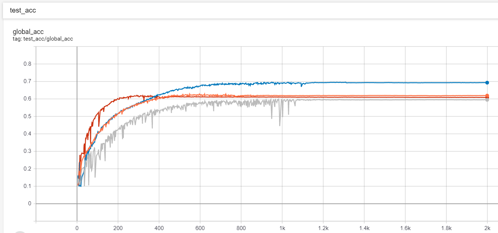

# Federated Learning mini-framework

This repo contains a Federated Learning (FL) setup with the Keras (Tensorflow) framework. The purpose is to have the
codebase with which you can run FL experiments easily, for both IID and Non-IID data.

The two main components are: Server and Client. The **Server** contains the model description, distributes the data
and coordinates the learning. And for all the clients it summarizes the results to update it's own (global) model.
The **Clients** have different random chunks of data and the model description with the global model's weights. From
this initialized status they can start the training on their own dataset for a few iterations. In a real world
scenario the clients are edge devices and the training is running in parallel.

In this setup the client trainings are running sequentially and you can use only your CPU or just 1 GPU.

## Cifar10 - "Shallow" VGG16

Training with a shallow version of VGG16 on Cifar10 with IID data where we had 100 clients and for each round (global epoch) we used only
10% of them (selected randomly at each communication round). Every client fitted 1 epoch on "their part" of the data with the batch size of `[blue: 8, orange: 64, gray: 256]` and with learning rate of `0.1`.

A "single model" training (1 client with all the data) is also shown (`red`) on the graph. Batch size was `256` and the learning rate was: `0.05`.

(The Tensorboard logs are (for each experiment) included in the release, so you can easily visualize them.)

## About

Gábor Vecsei

- [Website](https://gaborvecsei.com)
- [Twitter](https://twitter.com/GAwesomeBE)
- [LinkedIn](https://www.linkedin.com/in/gaborvecsei)
- [Personal Blog](https://gaborvecsei.wordpress.com/)
- [Github](https://github.com/gaborvecsei)
